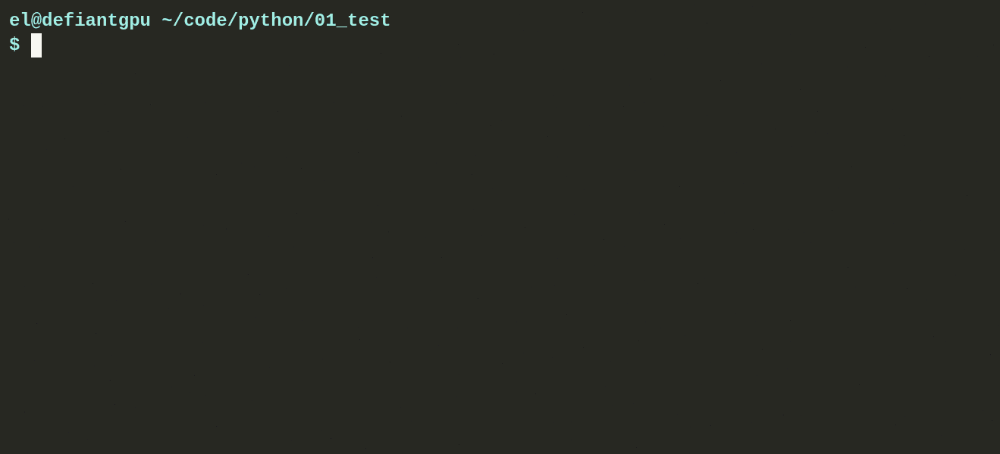

# better-exceptions, customized for Gentoo

Parent: https://github.com/Qix-/better-exceptions

## Jist install

    root> emerge -avNu python-pip
    root> emerge -avNu pygments
    pip install --user better-exceptions
    #Pip puts the stuffs under ~/.local/lib/python3.7/site-packages/better_exceptions

    #put this in your ~/.bashrc or just-in-time before the invocation of the python3 interpreter:
    export BETTER_EXCEPTIONS=1

    #I put something like this in my .bashrc, that way I can flip it on or off as needed
    alias python37_with_better_exceptions="BETTER_EXCEPTIONS=1 python3 "

## Demo

# License
Copyright &copy; 2017, Josh Junon. Licensed under the [MIT license](LICENSE.txt).
